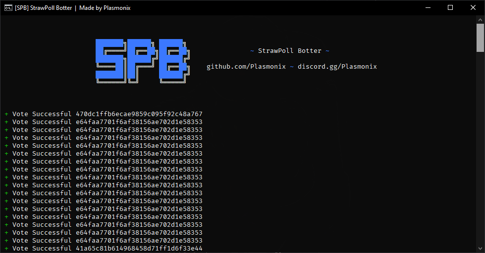

## 🛠 Installation & Usage

> **💻 Install**
```
git clone https://github.com/Plasmonix/SPB
cd SPB
pip install -r requirements.txt
```
> **🖥️ Start**
```
run main.py
```  

## 📷 Demo


## 🏁 Milestones
- 50 Stars / 100 Followers - Proxy support
- 100 Stars / 150 Followers - Captcha bypass

## 📚 Contributions
All suggestions are welcome.

## 📜 License
This project is licensed under [GNU General Public License](https://github.com/Plasmonix/SPB/blob/main/LICENSE).

<p align="center">
  
  
  
</p>
